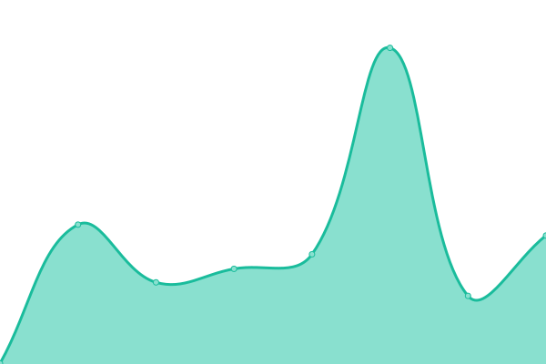
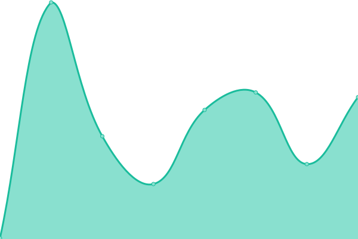

# [📈 Live Status](https://leies-202.github.io/le-upptime/): <!--live status--> **全サイト正常稼働中。**

This repository contains the open-source uptime monitor and status page for [Leies](https://me.lei202.com/), powered by [Upptime](https://github.com/upptime/upptime).

With [Upptime](https://upptime.js.org), you can get your own unlimited and free uptime monitor and status page, powered entirely by a GitHub repository. We use [Issues](https://github.com/Leies-202/le-upptime/issues) as incident reports, [Actions](https://github.com/Leies-202/le-upptime/actions) as uptime monitors, and [Pages](https://leies-202.github.io/le-upptime/) for the status page.

<!--start: status pages-->
<!-- This summary is generated by Upptime (https://github.com/upptime/upptime) -->
<!-- Do not edit this manually, your changes will be overwritten -->
<!-- prettier-ignore -->
| URL | Status | History | Response Time | Uptime |
| --- | ------ | ------- | ------------- | ------ |
|  [me](https://me.lei202.com) | 🟩 Up | [me.yml](https://github.com/Leies-202/le-upptime/commits/HEAD/history/me.yml) | 

 131ms
     
 | 

<a href="https://status.lei202.com/history/me">100.00%</a>
    

|  [Leisskey(れいすきー)](https://mk.lei202.com) | 🟩 Up | [leisskey.yml](https://github.com/Leies-202/le-upptime/commits/HEAD/history/leisskey.yml) | 

 880ms
     
 | 

<a href="https://status.lei202.com/history/leisskey">100.00%</a>
    

|  [lei202.com](https://lei202.com) | 🟩 Up | [lei202-com.yml](https://github.com/Leies-202/le-upptime/commits/HEAD/history/lei202-com.yml) | 

 175ms
     
 | 

<a href="https://status.lei202.com/history/lei202-com">100.00%</a>
    

|  [Blog](https://blog.lei202.com) | 🟩 Up | [blog.yml](https://github.com/Leies-202/le-upptime/commits/HEAD/history/blog.yml) | 

 241ms
     
 | 

<a href="https://status.lei202.com/history/blog">100.00%</a>
    

<!--end: status pages-->

[**Visit our status website →**](https://leies-202.github.io/le-upptime/)

## 📄 License

- Powered by: [Upptime](https://github.com/upptime/upptime)
- Code: [MIT](./LICENSE) © [Leies](https://me.lei202.com/)
- Data in the `./history` directory: [Open Database License](https://opendatacommons.org/licenses/odbl/1-0/)
